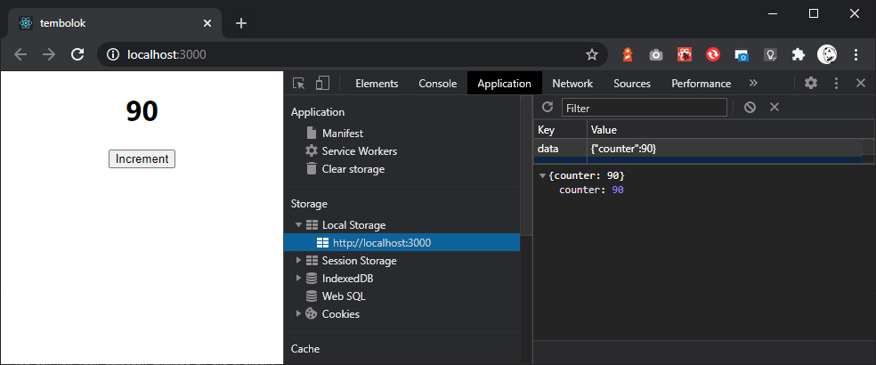

# Tembolok

Persistent state management for React 

[](https://www.npmjs.com/package/tembolok) [](https://standardjs.com)

## Install

```bash
yarn add tembolok
```

or, if you using npm

```bash
npm install --save tembolok
```

## useStore in action



## Sample code

```jsx
import React from 'react'
import { useStore } from 'tembolok'

const App = () => {
  const [data, setData] = useStore('data')

  const increment = () => {
    setData({
      counter: (data?.counter || 0) + 1,
    })
  }

  return (
    <div>
      <h1>{data.counter || 0}</h1>
      <button onClick={increment}>Increment</button>
    </div>
  )
}

export default App

```

## License

MIT © [arbo77](https://github.com/arbo77)
